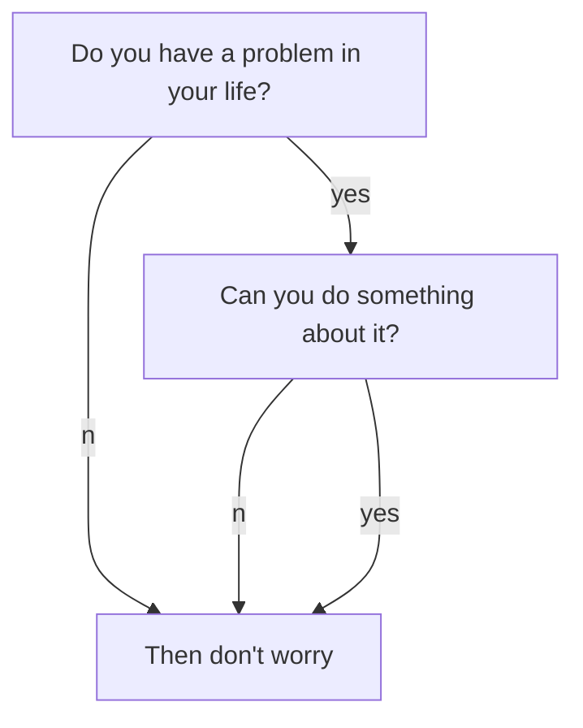

블로그 포스트의 기본 템플릿 & 가이드를 이 페이지에 만들어놓았다.

<!-- more -->

<h2 id='h1'>(1) Markdown 문법</h2>
<https://gist.github.com/ihoneymon/652be052a0727ad59601>

<h2 id='h2'>(2) 유용한 팁</h2>
1) 글을 분류하기 위해 올바른 태그를 달자.
2) 태그는 띄어쓰기 기준으로 분류된다.
3) aside 탭을 사용하기 위해서는 aside 옵션에서 toc: true로 설정한 후 <h1>, <h2>, <h3>, ... 태그를 이용한다.
태그에는 반드시 id가 있어야 한다.

<h2 id='h3'>(3) 스타일</h2>

<div class="hero" style="background-color: #ccc;">
  <div class="hero__content">
    <h3>Hero</h3>
  </div>
</div>

```java
public class BootSpringBootApplication {
  public static void main(String[] args) {
    System.out.println("Hello, Honeymon");
  }
}
```

Success Text.
{:.success}
Info Text.
{:.info}
Warning Text.
{:.warning}
Error Text.
{:.error}
`success`{:.success}
`info`{:.info}
`warning`{:.warning}
`error`{:.error}
{:.border}
{:.shadow}
{:.rounded}
{:.circle}
{:.border.rounded}
{:.circle.shadow}
{:.circle.border.shadow}

When $$a \ne 0$$, there are two solutions to $$ax^2 + bx + c = 0$$ and they are
$$x_1 = {-b + \sqrt{b^2-4ac} \over 2a}$$
$$x_2 = {-b - \sqrt{b^2-4ac} \over 2a} \notag$$



```chart
{
  "type": "polarArea",
  "data": {
    "datasets": [
      {
        "data": [
          11,
          16,
          7,
          3,
          14
        ],
        "backgroundColor": [
          "#FF6384",
          "#4BC0C0",
          "#FFCE56",
          "#E7E9ED",
          "#36A2EB"
        ],
        "label": "My dataset"
      }
    ],
    "labels": [
      "Red",
      "Green",
      "Yellow",
      "Grey",
      "Blue"
    ]
  },
  "options": {}
}
```

참조 :
- https://tianqi.name/jekyll-TeXt-theme/docs/en/quick-start
- https://gist.github.com/ihoneymon/652be052a0727ad59601